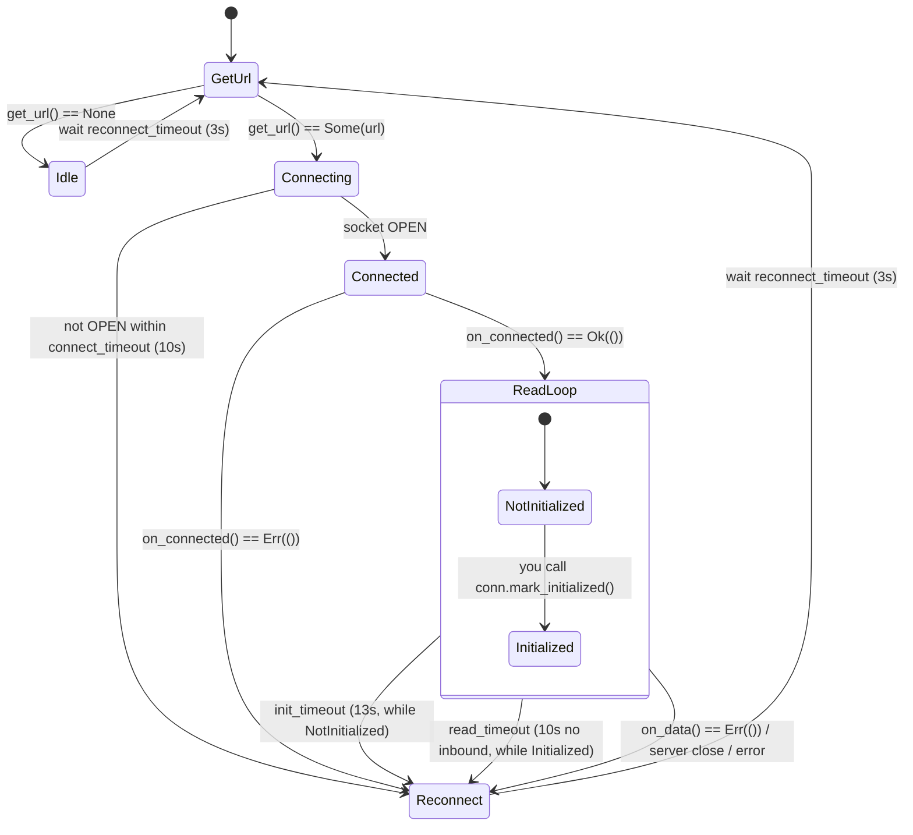

# my-web-sockets-wasm

A thin, auto-reconnecting **WebSocket client for the browser (WASM)**. It wraps the
native JavaScript `web_sys::WebSocket`, adapts its four DOM events into a
`futures::Stream`, and drives a reconnect + timeout loop on the **Dioxus** runtime.

It was extracted from the `mt-client` trading terminal and is shared by `mt-client`
and `mt-admin`.

> **Not** a `reqwest`/`tungstenite` client. `reqwest` has no WebSocket support in
> WASM, so this crate talks to the browser socket directly. For a **non-WASM**
> (CLI / backend / daemon) WebSocket client, use the sibling crate
> [`my-web-socket-client`](https://github.com/MyJetTools/my-web-socket-client)
> instead — it has a similar callback shape plus built-in heartbeat.

---

## Why this crate exists

| | `my-web-sockets-wasm` (this crate) | `my-web-socket-client` (sibling) |
|---|---|---|
| Target | Browser / WASM only | Native (tokio) |
| Transport | `web_sys::WebSocket` | `hyper-tungstenite` |
| Runtime | Dioxus (`spawn`) | tokio |
| Auto-reconnect | ✅ | ✅ |
| Built-in heartbeat/ping | ❌ (server must push, or you ping) | ✅ (`start(Some(msg), …)`) |
| Binary send | via raw handle only | ✅ |
| URL provider | `WsCallback::get_url()` (sync) | separate `WsClientSettings` (async) |

A key detail this crate gets right: on `Drop` it **detaches all four JS listeners
before** the wasm-bindgen `Closure`s are freed. Without that, a browser-fired
`close` event arriving after teardown invokes a freed closure and wasm-bindgen
panics with *"closure invoked recursively or after being dropped"* — the exact bug
`reqwasm` / `gloo-net` 0.5/0.6 have. If you were reaching for `gloo-net` for
reconnecting sockets, this is the reason not to.

---

## Requirements

- A **Dioxus 0.7** app compiled to WASM. `start()` calls `dioxus::prelude::spawn`,
  so it **must be invoked from inside a Dioxus reactive context** (a component body
  or a `use_coroutine` / spawned task). Calling it from plain WASM outside a Dioxus
  scope panics.
- Rust **1.85+** (the crate uses `edition = "2024"`).

## Installation

```toml
[dependencies]
my-web-sockets-wasm = { git = "https://github.com/MyJetTools/my-web-sockets-wasm.git" }
# pin a tag/rev per your org convention, e.g. `, tag = "0.1.0"`
```

---

## How it works



The whole loop lives in one spawned task. You supply behaviour by implementing
**one trait**, `WsCallback`:

```rust
pub trait WsCallback: 'static {
    /// Called on every (re)connect attempt. Return `None` to stay idle and retry
    /// later — useful before login (no token yet). Return `Some(url)` to connect.
    fn get_url(&self) -> Option<String>;

    /// Socket reached OPEN. Send your first frame / capture the handle here.
    /// Returning `Err(())` forces a disconnect + reconnect.
    async fn on_connected(&self, conn: Rc<WsConnection>) -> Result<(), ()>;

    /// One inbound frame (Text or Bytes). Runs inline in the read loop.
    /// Returning `Err(())` forces a disconnect + reconnect.
    async fn on_data(&self, conn: Rc<WsConnection>, msg: Message) -> Result<(), ()>;

    /// Socket closed (any reason). Clean up here.
    async fn on_disconnected(&self, conn: Rc<WsConnection>);
}
```

`get_url()` is re-evaluated on **every** reconnect attempt. That is what lets a
socket "arm itself" after login: return `None` while there is no session token,
and the loop idle-retries until `get_url()` starts returning a URL.

---

## ⚠️ The one thing you must not forget: `mark_initialized()`

The read loop runs a **two-phase keep-alive**:

1. **Before initialization** — the connection must be "initialized" within
   `init_timeout` (**13s**). If `conn.is_initialized()` is still `false` at 13s, the
   loop logs `WS: init timeout`, drops the socket, and reconnects.
2. **After initialization** — a `read_timeout` (**10s** since the last inbound
   frame) takes over. 10s of silence ⇒ drop + reconnect.

**`mark_initialized()` is never called for you.** You must call
`conn.mark_initialized()` yourself — typically from `on_data` when the server's
init/handshake frame arrives. **If you forget, the connection is force-dropped
every ~13 seconds and reconnects forever**, with only a `WS: init timeout` line in
the console as a clue.

```rust
async fn on_data(&self, conn: Rc<WsConnection>, msg: Message) -> Result<(), ()> {
    let parsed = parse(msg);
    if matches!(parsed, ServerMsg::Initialized) {
        conn.mark_initialized(); // ← switches init_timeout → read_timeout
    }
    // …dispatch…
    Ok(())
}
```

If your server has **no** init handshake, call `mark_initialized()` at the end of
`on_connected` so the connection immediately enters the steady read-timeout phase.

---

## Quick start (minimal)

```rust
use std::rc::Rc;
use my_web_sockets_wasm::{Message, WebSocketClient, WsCallback, WsConnection};

struct MyHandler;

impl WsCallback for MyHandler {
    fn get_url(&self) -> Option<String> {
        Some("wss://example.com/ws".to_string())
    }

    async fn on_connected(&self, conn: Rc<WsConnection>) -> Result<(), ()> {
        conn.send_text(r#"{"op":"subscribe","channel":"ticker"}"#);
        Ok(())
    }

    async fn on_data(&self, conn: Rc<WsConnection>, msg: Message) -> Result<(), ()> {
        match msg {
            Message::Text(text) => {
                // Your server has no explicit init frame? Mark ready on first data:
                if !conn.is_initialized() {
                    conn.mark_initialized();
                }
                log::info!("recv: {text}");
            }
            Message::Bytes(bytes) => log::info!("recv {} bytes", bytes.len()),
        }
        Ok(())
    }

    async fn on_disconnected(&self, _conn: Rc<WsConnection>) {
        log::warn!("disconnected");
    }
}

// Call this from inside a Dioxus component / spawned task:
fn start_ws() {
    let client = WebSocketClient::new();
    client.start(Rc::new(MyHandler)); // start(Rc<TCallback: WsCallback>)
}
```

The client keeps running and reconnecting until it is dropped or you call
`client.stop()`.

---

## Sending messages

There are two patterns. Pick based on **where** your sends originate.

### 1. From inside a callback — `conn.send_text`

`WsConnection` (handed to every callback) has `send_text` / `send_bytes`, both
returning `Result<(), WsError>`:

```rust
conn.send_text("ping")?;             // text frame
conn.send_bytes(&[0x01, 0x02])?;     // binary frame
```

They return `Err(WsError::NotConnected)` if the connection has been marked
disconnected, or `Err(WsError::SendFailed(_))` if the browser rejects the send.

### 2. From UI / signal code outside the callback — capture the raw handle

This is the pattern `mt-client` actually uses, because subscriptions are sent in
response to user actions, not from inside `on_data`. In `on_connected`, stash the
raw browser socket into a shared cell; clear it in `on_disconnected`:

```rust
use std::cell::RefCell;
use std::rc::Rc;

#[derive(Clone)]
pub struct WsSender {
    ws: Rc<RefCell<Option<web_sys::WebSocket>>>,
}

impl WsSender {
    pub fn new(ws: Rc<RefCell<Option<web_sys::WebSocket>>>) -> Self { Self { ws } }

    pub fn send(&self, msg: String) {
        if let Some(ws) = self.ws.borrow().as_ref() {
            let _ = ws.send_with_str(&msg);        // text
            // let _ = ws.send_with_u8_array(&buf); // binary (same web_sys::WebSocket)
        }
    }
}

// inside the WsCallback impl:
async fn on_connected(&self, conn: Rc<WsConnection>) -> Result<(), ()> {
    *self.ws_handle.borrow_mut() = Some(conn.ws_handle()); // hand out the raw socket
    Ok(())
}

async fn on_disconnected(&self, _conn: Rc<WsConnection>) {
    *self.ws_handle.borrow_mut() = None; // invalidate the sender
}
```

`conn.ws_handle()` returns a clone of the underlying `web_sys::WebSocket`, so you
can `send_with_str` / `send_with_u8_array` from anywhere that holds the shared
`WsSender`. (From inside a callback you can instead use the guarded
`conn.send_text` / `conn.send_bytes`.)

---

## Error handling & disconnect semantics

- Returning **`Err(())`** from `on_connected` or `on_data` tells the client to
  **disconnect and reconnect**. Use it for things like token refresh
  (`on InvalidToken → refresh → Err(())` to reopen the socket with a fresh URL) or
  a deliberate cool-down after a server error frame.
- Returning **`Ok(())`** keeps the connection.
- Internally the read loop turns transport errors, server closes, and a
  slow-consumer overflow into a `WsError` (which implements `Display` /
  `std::error::Error`) and logs it before reconnecting.
- `on_disconnected` is called for every closed socket, **but** the current
  disconnect reason (init timeout vs read timeout vs server `Close{code, reason}`
  vs transport error) is not passed to it — you get the callback, not the cause.

---

## Reconnect & timeout defaults

All four timeouts are **hardcoded** in `WebSocketClient::new()` and are **not
configurable** in this version:

| Timeout | Default | Meaning |
|---|---|---|
| `reconnect_timeout` | 3 s | Wait before each reconnect attempt |
| `connect_timeout` | 10 s | Max wait for the socket to reach `OPEN` |
| `init_timeout` | 13 s | Must call `mark_initialized()` within this, or drop |
| `read_timeout` | 10 s | Max inbound silence after init, or drop |

---

## Backpressure

Inbound frames are buffered in a **bounded** channel (`INCOMING_BUFFER_SIZE`,
default **1024**). The browser socket cannot be paused, so true producer
backpressure isn't possible; instead, if `on_data` falls far enough behind that
the buffer fills, the connection is treated as a **slow consumer** — it is closed
and reconnected, surfacing `WsError::SlowConsumer` in the log.

This never silently drops or reorders frames, so it is safe for order-book / delta
feeds: the reconnect runs your `on_connected` resubscribe/resync path (see below)
and the state is rebuilt cleanly. The practical rule: **keep `on_data` fast** and
offload heavy work with `spawn`; only a persistently slow consumer overflows.

> Want *drop-oldest* / *drop-newest* instead of disconnect-on-overflow? That's a
> one-line change in the `on_message` overflow branch in `managed_ws.rs` — but for
> incremental feeds, disconnect-and-resync is the correct default.

---

## Real-world pattern: subscriptions + reconnect replay

The server in `mt-client` has **reset semantics**: every `subscribe-*` frame carries
the *full* desired instrument list (subscribe == unsubscribe == "here is the
complete set"), and it **forgets all subscriptions across sockets**. So the app:

- diffs *desired* vs *last-sent* per stream and only emits the streams that changed
  (`reconcile_subscriptions`), called on every event that changes what's needed
  (instrument selection, widget add/close, order/position changes, and reconnect);
- on **reconnect** (tracked with a `Cell<bool> first_connect`), bumps a reconnect
  version and calls `reconcile_subscriptions` again to **replay everything**,
  because the fresh socket starts with no subscriptions.

```rust
// text frames are "<verb>:<json>", e.g.
sender.send(format!("subscribe-orderbook:{}", payload));
sender.send(format!("subscribe-bid-ask:{}", payload));
```

If your server keeps subscriptions per session, you can skip the replay; if it
resets like this one, do your (re)subscription work in `on_connected`.

---

## Public API reference

| Item | Summary |
|---|---|
| `WebSocketClient::new() -> Self` | Build a client with the default timeouts. |
| `WebSocketClient::start(&self, cb: Rc<impl WsCallback>)` | Spawn the reconnect loop (needs a live Dioxus runtime). |
| `WebSocketClient::stop(&self)` | Stop the loop. **Terminal** — a client cannot be restarted after `stop()`; make a new one. |
| `WsCallback` | The trait you implement: `get_url`, `on_connected`, `on_data`, `on_disconnected`. |
| `WsConnection::send_text(&self, &str) -> Result<(), WsError>` | Send a text frame (guarded by connection state). |
| `WsConnection::send_bytes(&self, &[u8]) -> Result<(), WsError>` | Send a binary frame (guarded by connection state). |
| `WsConnection::ws_handle(&self) -> web_sys::WebSocket` | Raw socket clone — for out-of-band sends. |
| `WsConnection::state(&self) -> WsState` | Current socket `readyState`. |
| `WsConnection::mark_initialized(&self)` | **Mandatory** — switches init-timeout → read-timeout. |
| `WsConnection::is_initialized(&self) -> bool` | Whether `mark_initialized()` was called. |
| `WsConnection::is_connected(&self) -> bool` | Logical connection flag. |
| `WsConnection::disconnect(&self)` | Flag the connection for teardown. |
| `Message` | `Text(String)` \| `Bytes(Vec<u8>)` — delivered to `on_data` (`Debug`, `Clone`). |
| `WsState` | Socket `readyState`; returned by `state()`. `Debug`/`Copy`/`Eq`. |
| `WsError` | Error type: returned by the send methods and used internally. `Display` + `std::error::Error`. |

---

## Known limitations & gotchas

Behaviour worth knowing before you build on this crate (verified against the
source):

- **`mark_initialized()` is a mandatory, silent contract** — see the callout above.
  This is the single biggest footgun.
- **Keep `on_data` fast.** It is `await`-ed inline inside the read loop. Heavy work
  belongs in a separate `spawn`; a persistently slow `on_data` overflows the bounded
  inbound buffer and triggers a slow-consumer reconnect (see [Backpressure](#backpressure)).
- **No built-in heartbeat.** Keep-alive relies on the *server* pushing something
  within `read_timeout` (10 s). For an idle / request-response protocol you must
  send your own periodic pings (via the raw handle), or the socket drops and
  reconnects on a 10 s cycle.
- **Timeouts are not configurable.** They are baked into `new()`.
- **`on_disconnected` pairing is asymmetric** on the connect path: a socket that
  times out *before* `on_connected` runs does **not** get an `on_disconnected`
  call, whereas an `on_connected` that returns `Err(())` does. Don't rely on a
  strict connect/disconnect pairing for resource cleanup.

Timeouts are measured with the monotonic `performance.now()` clock, so a system
clock jump or sleep/resume does **not** cause spurious reconnects.

None of the above block normal use inside a Dioxus app — they are the edges to
design around, and the maintainer TODO list if this crate is hardened further.

---

## License

Follows the MyJetTools organization convention (MIT unless stated otherwise).
